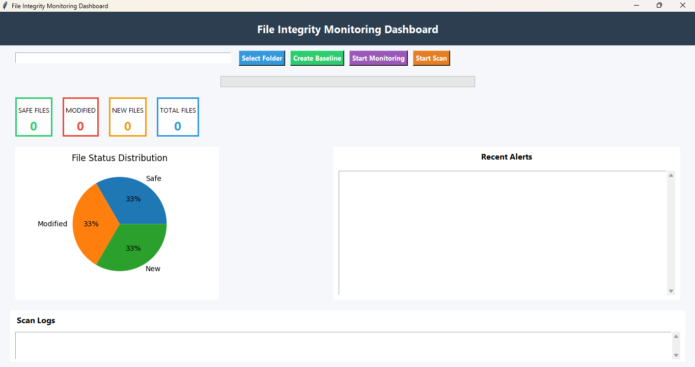
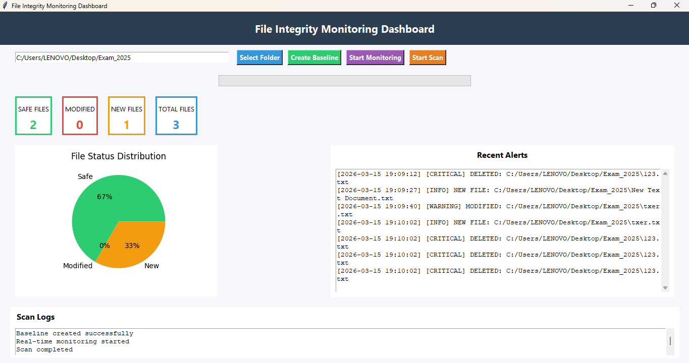

# File Integrity Monitoring Dashboard

A Python-based cybersecurity tool that monitors file systems for unauthorized changes.  
The application detects file creation, modification, and deletion events in real time and logs them for forensic analysis.

---

## Project Overview

This project implements a **File Integrity Monitoring (FIM) system** with a graphical dashboard.  
It helps detect suspicious file activity by comparing file hashes and monitoring filesystem events.

The system is conceptually similar to professional tools like Tripwire and Wazuh used in security operations.

---

## Key Features

- Real-time file monitoring
- File integrity verification using SHA-256 hashing
- Baseline snapshot creation
- Detection of:
  - File creation
  - File modification
  - File deletion
- Timestamped security alerts
- Alert severity classification (INFO / WARNING / CRITICAL)
- CSV forensic report generation
- Graphical dashboard with statistics and alerts
- Folder selection and scanning interface

---

## Technologies Used

| Technology | Purpose |
|-----------|--------|
| Python | Core programming language |
| Tkinter | GUI dashboard |
| Watchdog | Real-time file monitoring |
| Hashlib | SHA-256 file integrity verification |
| Matplotlib | Data visualization |
| CSV | Forensic report logging |

---

## How It Works

1. User selects a folder to monitor.
2. The system creates a **baseline snapshot** of file hashes.
3. Real-time monitoring detects file system changes.
4. When a file event occurs:
   - An alert is generated
   - Event is displayed in the dashboard
   - Event is logged into a CSV forensic report.

---

## Example Alerts

## Dashboard Preview

### Main Dashboard

### Alert Detection

